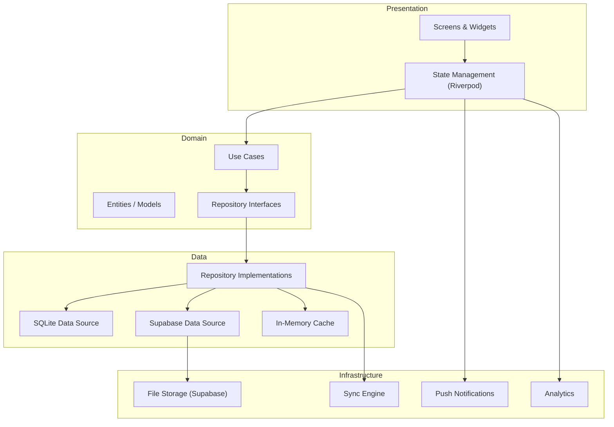
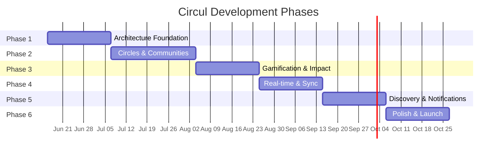

# Circul — Comprehensive App Blueprint

> **Versi**: 2.0  
> **Tanggal**: 2026-06-09  
> **Status**: Draft — Menunggu review  
> **Berdasarkan**: Analisis codebase `lib/` saat ini (v1.0.0+1)

---

## Ringkasan Eksekutif

**Circul** adalah platform aksi lingkungan berbasis komunitas yang membantu orang mendokumentasikan kondisi lingkungan lokal, mengubah check-in menjadi sinyal peta yang terlihat, dan menjaga aksi komunitas tetap berjalan melalui post, komentar, event, dan riwayat dampak personal.

Blueprint ini menguraikan **6 fase pengembangan** dari fondasi arsitektur sampai kesiapan rilis produksi. Setiap fase dirancang agar deliverable-nya bisa di-deploy dan di-test secara independen.

---

## Status Codebase Saat Ini

### Apa yang Sudah Ada

| Area | Status | File Utama |
|---|---|---|
| Welcome / Onboarding | ✅ Lengkap (2512 baris) | `lib/welcome/welcome_flow.dart` |
| Auth (Supabase) | ✅ Lengkap | `lib/auth/supabase_auth_repository.dart` |
| Profile CRUD | ✅ Lengkap | `lib/profile/profile_screen.dart`, `edit_profile_screen.dart` |
| Feed / Post | ✅ Lengkap | `lib/home/home_screen.dart`, `lib/home/widgets/feed_post_card.dart` |
| Post Composer | ✅ Lengkap | `lib/new_post/new_post_screen.dart` |
| Comments | ✅ Lengkap | `lib/comments/comment_screen.dart` |
| Map (OSM) | ✅ Lengkap | `lib/map/map_screen.dart` (84KB) |
| Check-in / Capture | ✅ Lengkap | `lib/check_in/capture_result_screen.dart` |
| Search / Topics | ✅ Lengkap | `lib/search/search_screen.dart` |
| Event | ⚠️ Placeholder | `lib/event/event_screen.dart` (286 bytes) |
| Local DB (SQLite) | ✅ Lengkap | `lib/local_database.dart` |
| Supabase Profiles | ✅ Lengkap | `supabase/migrations/20260607000000_create_profiles.sql` |
| Widget Tests | ✅ Komprehensif | `test/widget_test.dart` (50KB) |

### Masalah Arsitektur yang Teridentifikasi

| # | Masalah | Severity | Detail |
|---|---|---|---|
| A1 | **God files** | 🔴 Tinggi | `map_screen.dart` (84KB), `welcome_flow.dart` (72KB), `search_screen.dart` (37KB) |
| A2 | **Tidak ada state management** | 🔴 Tinggi | State diangkat manual via callback chains di `_CirculShellState` |
| A3 | **Tidak ada routing library** | 🟡 Sedang | Semua navigasi manual via `Navigator.push`, tab via `IndexedStack` |
| A4 | **Repository di root** | 🟡 Sedang | `feed_post_repository.dart`, `user_repository.dart` dll langsung di `lib/` |
| A5 | **Event screen kosong** | 🟡 Sedang | Hanya 286 bytes placeholder |
| A6 | **Belum ada circle/community** | 🔴 Tinggi | Fitur inti app belum ada |
| A7 | **Mock data hardcoded** | 🟡 Sedang | Semua seed data di `mock_data.dart` tanpa factory pattern |
| A8 | **Tidak ada DI framework** | 🟡 Sedang | Repository diinject manual lewat constructor |
| A9 | **Belum ada notification** | 🟡 Sedang | Tidak ada push notification infrastructure |
| A10 | **Belum ada offline sync** | 🟡 Sedang | `sync_status` column ada tapi belum dipakai |

---

## Arsitektur Target

### Diagram Layer



### Folder Arsitektur Target

```text
lib/
├── app/
│   ├── app.dart                    # MaterialApp + Theme
│   ├── router.dart                 # GoRouter configuration
│   ├── theme/
│   │   ├── app_theme.dart          # ThemeData factory
│   │   ├── color_tokens.dart       # Design tokens
│   │   └── text_styles.dart        # Typography system
│   └── di/
│       └── providers.dart          # Riverpod providers
│
├── core/
│   ├── constants.dart              # (sudah ada)
│   ├── app_assets.dart             # (sudah ada)
│   ├── errors/
│   │   ├── failures.dart           # Domain failure types
│   │   └── exceptions.dart         # Data layer exceptions
│   ├── network/
│   │   ├── network_info.dart       # Connectivity checker
│   │   └── supabase_client.dart    # Supabase singleton
│   └── utils/
│       ├── date_utils.dart         # Timestamp formatting
│       ├── validators.dart         # Input validation
│       └── extensions.dart         # Dart extensions
│
├── features/
│   ├── auth/
│   │   ├── data/
│   │   │   ├── auth_repository_impl.dart
│   │   │   ├── supabase_auth_data_source.dart
│   │   │   └── local_auth_data_source.dart
│   │   ├── domain/
│   │   │   ├── auth_repository.dart        # Interface
│   │   │   ├── entities/
│   │   │   │   └── auth_user.dart
│   │   │   └── usecases/
│   │   │       ├── sign_in.dart
│   │   │       ├── sign_up.dart
│   │   │       └── sign_out.dart
│   │   └── presentation/
│   │       ├── providers/
│   │       │   └── auth_provider.dart
│   │       └── screens/
│   │           └── ... (existing welcome flow screens)
│   │
│   ├── feed/
│   │   ├── data/
│   │   │   ├── feed_repository_impl.dart
│   │   │   ├── local_feed_data_source.dart
│   │   │   └── remote_feed_data_source.dart
│   │   ├── domain/
│   │   │   ├── entities/
│   │   │   │   ├── feed_post.dart
│   │   │   │   └── post_comment.dart
│   │   │   ├── feed_repository.dart
│   │   │   └── usecases/
│   │   │       ├── get_feed.dart
│   │   │       ├── create_post.dart
│   │   │       ├── like_post.dart
│   │   │       └── save_post.dart
│   │   └── presentation/
│   │       ├── providers/
│   │       ├── screens/
│   │       └── widgets/
│   │
│   ├── circles/                    # 🆕 FITUR BARU
│   │   ├── data/
│   │   ├── domain/
│   │   │   ├── entities/
│   │   │   │   ├── circle.dart
│   │   │   │   ├── circle_member.dart
│   │   │   │   └── circle_activity.dart
│   │   │   ├── circle_repository.dart
│   │   │   └── usecases/
│   │   │       ├── create_circle.dart
│   │   │       ├── join_circle.dart
│   │   │       ├── leave_circle.dart
│   │   │       └── get_circle_feed.dart
│   │   └── presentation/
│   │
│   ├── map/
│   ├── search/
│   ├── events/                     # 🆕 UPGRADE dari placeholder
│   ├── profile/
│   ├── check_in/
│   ├── impact/                     # 🆕 FITUR BARU
│   ├── notifications/              # 🆕 FITUR BARU
│   └── settings/                   # 🆕 FITUR BARU
│
├── shared/
│   ├── widgets/                    # (sudah ada, diperluas)
│   ├── services/
│   │   ├── image_service.dart
│   │   ├── location_service.dart
│   │   └── storage_service.dart
│   └── data/
│       ├── local_database.dart     # (sudah ada, pindah)
│       └── sync_engine.dart        # 🆕
│
└── main.dart
```

---

## Fase Pengembangan

---

## Phase 1: Architecture Foundation & Code Health
**Durasi**: 2-3 minggu  
**Prasyarat**: Tidak ada  
**Tujuan**: Memperbaiki fondasi arsitektur tanpa mengubah fitur yang ada

### 1.1 State Management — Riverpod

**Kenapa Riverpod?**
- Compile-time safety, auto-dispose, dan testability
- Lebih ringan dari BLoC untuk skala Circul saat ini
- Mendukung async provider untuk Supabase calls

**Yang Harus Dilakukan:**

```yaml
# Tambah ke pubspec.yaml
dependencies:
  flutter_riverpod: ^2.6.1
  riverpod_annotation: ^2.6.1
  
dev_dependencies:
  riverpod_generator: ^2.6.3
  build_runner: ^2.4.14
```

**Provider utama yang harus dibuat:**

```dart
// lib/app/di/providers.dart

// Auth state — menggantikan _AuthGate logic di main.dart
@riverpod
class AuthState extends _$AuthState {
  @override
  AsyncValue<AuthSession> build() { ... }
}

// Current user profile — menggantikan _currentUserProfile di CirculShellState
@riverpod
class CurrentUserProfile extends _$CurrentUserProfile {
  @override
  Future<EditableProfile> build() { ... }
}

// Feed posts — menggantikan callback chains
@riverpod
class FeedPostsNotifier extends _$FeedPostsNotifier {
  @override
  Future<List<FeedPost>> build() { ... }
}

// Repositories — injectable
@riverpod
FeedPostRepository feedPostRepository(ref) => FeedPostRepository();

@riverpod
UserRepository userRepository(ref) => UserRepository(
  remoteProfileDataSource: ref.watch(authRepositoryProvider),
);
```

**Refactor `main.dart` (493 baris → ~50 baris):**

| Sebelum | Sesudah |
|---|---|
| `_AuthGate` StatefulWidget | `authStateProvider` + `Consumer` |
| `_CirculShellState` dengan 12+ state vars | Providers terpisah per concern |
| Callback chains (`onPostCreated`, `onPostSaved` dll) | Provider invalidation |
| Manual repository injection | Riverpod providers |

### 1.2 Routing — GoRouter

```yaml
dependencies:
  go_router: ^15.1.2
```

**Route Map:**

```dart
// lib/app/router.dart

final router = GoRouter(
  initialLocation: '/',
  redirect: (context, state) {
    final auth = ref.read(authStateProvider);
    final isOnAuthRoute = state.matchedLocation.startsWith('/welcome');
    
    if (!auth.isAuthenticated && !isOnAuthRoute) return '/welcome';
    if (auth.isAuthenticated && isOnAuthRoute) return '/';
    return null;
  },
  routes: [
    // Auth shell
    GoRoute(
      path: '/welcome',
      builder: (_, __) => const WelcomeFlow(),
      routes: [
        GoRoute(path: 'login', builder: (_, __) => const EmailLoginScreen()),
        GoRoute(path: 'signup', builder: (_, __) => const CreateAccountScreen()),
        GoRoute(path: 'verify', builder: (_, __) => const OtpVerificationScreen()),
      ],
    ),
    
    // Main app shell dengan bottom nav
    StatefulShellRoute.indexedStack(
      builder: (_, __, shell) => CirculShell(navigationShell: shell),
      branches: [
        StatefulShellBranch(routes: [
          GoRoute(path: '/', builder: (_, __) => const HomeScreen()),
        ]),
        StatefulShellBranch(routes: [
          GoRoute(path: '/map', builder: (_, __) => const MapScreen()),
        ]),
        StatefulShellBranch(routes: [
          GoRoute(path: '/search', builder: (_, __) => const SearchScreen()),
        ]),
        StatefulShellBranch(routes: [
          GoRoute(path: '/events', builder: (_, __) => const EventScreen()),
        ]),
        StatefulShellBranch(routes: [
          GoRoute(
            path: '/profile',
            builder: (_, __) => const ProfileScreen(),
            routes: [
              GoRoute(path: 'edit', builder: (_, __) => const EditProfileScreen()),
              GoRoute(path: 'achievements', builder: (_, __) => const AchievementScreen()),
              GoRoute(path: 'settings', builder: (_, __) => const SettingsScreen()),
            ],
          ),
        ]),
      ],
    ),
    
    // Modals & full-screen overlays
    GoRoute(
      path: '/post/new',
      pageBuilder: (_, __) => const MaterialPage(
        fullscreenDialog: true,
        child: NewPostScreen(),
      ),
    ),
    GoRoute(path: '/post/:id/comments', builder: (_, state) => CommentScreen(postId: state.pathParameters['id']!)),
    GoRoute(path: '/image-viewer', builder: (_, state) => UploadedImageFullscreenPage(/* ... */)),
    GoRoute(path: '/circle/:id', builder: (_, state) => CircleDetailScreen(circleId: state.pathParameters['id']!)),
    GoRoute(path: '/event/:id', builder: (_, state) => EventDetailScreen(eventId: state.pathParameters['id']!)),
  ],
);
```

### 1.3 God File Decomposition

**`map_screen.dart` (84KB → 8-12 files):**

```text
lib/features/map/
├── presentation/
│   ├── screens/
│   │   └── map_screen.dart              # Shell + state coordination (~200 baris)
│   ├── widgets/
│   │   ├── map_view.dart                # FlutterMap wrapper
│   │   ├── check_in_tray.dart           # Check-in/out action sheet
│   │   ├── check_in_form.dart           # Camera + location form
│   │   ├── checkout_confirmation.dart   # Checkout flow
│   │   ├── nearby_check_ins_sheet.dart  # Bottom sheet list
│   │   ├── map_controls.dart            # Zoom, locate-me, flag buttons
│   │   ├── heatmap_overlay.dart         # Issue cluster rendering
│   │   ├── map_check_in_marker.dart     # Individual check-in markers
│   │   └── focused_check_in_card.dart   # Selected check-in detail
│   └── providers/
│       └── map_provider.dart            # Map state (location, clusters, zoom)
├── data/
│   └── map_repository_impl.dart
└── domain/
    ├── entities/
    │   ├── map_issue_cluster.dart
    │   ├── map_focused_check_in.dart
    │   └── map_check_in.dart
    └── map_repository.dart
```

**`welcome_flow.dart` (72KB → 10-15 files):**

```text
lib/features/auth/
├── presentation/
│   ├── screens/
│   │   ├── welcome_screen.dart
│   │   ├── login_method_screen.dart
│   │   ├── email_login_screen.dart
│   │   ├── create_account_screen.dart
│   │   ├── create_password_screen.dart
│   │   ├── username_screen.dart
│   │   ├── otp_verification_screen.dart
│   │   └── welcome_flow_shell.dart     # AnimatedSwitcher coordinator
│   ├── widgets/
│   │   ├── welcome_scaffold.dart
│   │   ├── welcome_primary_button.dart
│   │   ├── password_security_meter.dart
│   │   ├── social_login_button.dart
│   │   └── username_suggestions.dart
│   └── providers/
│       ├── auth_provider.dart
│       └── welcome_flow_provider.dart
├── domain/
│   ├── entities/
│   │   ├── auth_user.dart
│   │   └── password_security.dart
│   ├── auth_repository.dart
│   └── usecases/
│       ├── sign_in_with_email.dart
│       ├── sign_up_with_email.dart
│       ├── verify_email_otp.dart
│       └── check_username_availability.dart
└── data/
    ├── supabase_auth_data_source.dart
    └── auth_repository_impl.dart
```

### 1.4 Repository Reorganization

Pindahkan root-level repositories ke feature folders:

| File Saat Ini | Lokasi Baru |
|---|---|
| `lib/feed_post_repository.dart` | `lib/features/feed/data/feed_repository_impl.dart` |
| `lib/comment_repository.dart` | `lib/features/feed/data/comment_repository_impl.dart` |
| `lib/saved_post_repository.dart` | `lib/features/feed/data/saved_post_repository_impl.dart` |
| `lib/liked_post_repository.dart` | `lib/features/feed/data/liked_post_repository_impl.dart` |
| `lib/user_repository.dart` | `lib/features/profile/data/user_repository_impl.dart` |
| `lib/local_database.dart` | `lib/shared/data/local_database.dart` |
| `lib/mock_data.dart` | `lib/shared/data/seed_data.dart` + entity files |

### 1.5 Theme System

```dart
// lib/app/theme/color_tokens.dart
abstract class CirculColors {
  // Primary
  static const green = Color(0xFF34C77B);
  static const softGreen = Color(0xFFE9FFF0);
  static const darkGreen = Color(0xFF1B8A52);
  
  // Neutral
  static const ink = Color(0xFF111827);
  static const muted = Color(0xFF6B7280);
  static const subtle = Color(0xFF9CA3AF);
  static const line = Color(0xFFE5E7EB);
  static const background = Color(0xFFF9FAFB);
  static const surface = Colors.white;
  
  // Semantic
  static const error = Color(0xFFE5484D);
  static const warning = Color(0xFFE7A31A);
  static const success = Color(0xFF34C77B);
  static const info = Color(0xFF3B82F6);
  
  // Impact levels (untuk map heatmap)
  static const impactLow = Color(0xFF86EFAC);
  static const impactMedium = Color(0xFFFBBF24);
  static const impactHigh = Color(0xFFEF4444);
}
```

### 1.6 Acceptance Criteria Phase 1

- [ ] `flutter analyze` — 0 errors, 0 warnings
- [ ] `flutter test` — semua existing tests pass
- [ ] Semua navigasi bekerja identik dengan versi sebelumnya
- [ ] State tidak hilang saat pindah tab
- [ ] Auth flow (sign up, sign in, OTP) masih berfungsi
- [ ] Hot reload tetap cepat (<2 detik)
- [ ] Tidak ada god file di atas 500 baris (kecuali generated code)

---

## Phase 2: Core Social Features — Circles & Communities
**Durasi**: 3-4 minggu  
**Prasyarat**: Phase 1 selesai  
**Tujuan**: Membangun fitur circles sebagai jantung sosial Circul

### 2.1 Data Model — Circles

**Supabase Migration:**

```sql
-- 20260615000000_create_circles.sql

-- Circle / Community
create table if not exists public.circles (
  id uuid primary key default gen_random_uuid(),
  name text not null,
  slug text not null unique,
  description text not null default '',
  cover_image_url text,
  avatar_url text,
  category text not null default 'general',
  is_public boolean not null default true,
  requires_approval boolean not null default false,
  max_members integer,
  location_name text,
  location_lat double precision,
  location_lng double precision,
  created_by uuid not null references auth.users(id),
  created_at timestamptz not null default now(),
  updated_at timestamptz not null default now()
);

create unique index circles_slug_idx on public.circles (lower(slug));

-- Circle Members
create table if not exists public.circle_members (
  id uuid primary key default gen_random_uuid(),
  circle_id uuid not null references public.circles(id) on delete cascade,
  user_id uuid not null references auth.users(id) on delete cascade,
  role text not null default 'member'
    check (role in ('owner', 'admin', 'moderator', 'member')),
  status text not null default 'active'
    check (status in ('active', 'pending', 'banned', 'left')),
  joined_at timestamptz not null default now(),
  unique(circle_id, user_id)
);

create index circle_members_circle_idx on public.circle_members(circle_id);
create index circle_members_user_idx on public.circle_members(user_id);

-- Circle Posts (extends feed_posts concept)
create table if not exists public.circle_posts (
  id uuid primary key default gen_random_uuid(),
  circle_id uuid not null references public.circles(id) on delete cascade,
  author_id uuid not null references auth.users(id),
  title text not null,
  body text not null,
  image_urls text[] not null default '{}',
  topic text not null default '',
  location_label text,
  location_lat double precision,
  location_lng double precision,
  likes_count integer not null default 0,
  comments_count integer not null default 0,
  is_pinned boolean not null default false,
  created_at timestamptz not null default now(),
  updated_at timestamptz not null default now()
);

create index circle_posts_circle_created_idx 
  on public.circle_posts(circle_id, created_at desc);

-- Circle Events
create table if not exists public.circle_events (
  id uuid primary key default gen_random_uuid(),
  circle_id uuid not null references public.circles(id) on delete cascade,
  title text not null,
  description text not null default '',
  cover_image_url text,
  location_name text,
  location_lat double precision,
  location_lng double precision,
  starts_at timestamptz not null,
  ends_at timestamptz,
  max_attendees integer,
  created_by uuid not null references auth.users(id),
  created_at timestamptz not null default now(),
  updated_at timestamptz not null default now()
);

-- Circle Event RSVPs
create table if not exists public.circle_event_rsvps (
  id uuid primary key default gen_random_uuid(),
  event_id uuid not null references public.circle_events(id) on delete cascade,
  user_id uuid not null references auth.users(id) on delete cascade,
  status text not null default 'going'
    check (status in ('going', 'interested', 'not_going')),
  created_at timestamptz not null default now(),
  unique(event_id, user_id)
);

-- RLS Policies
alter table public.circles enable row level security;
alter table public.circle_members enable row level security;
alter table public.circle_posts enable row level security;
alter table public.circle_events enable row level security;
alter table public.circle_event_rsvps enable row level security;

-- Circles: public readable, owner writable
create policy "Public circles are readable by all authenticated users"
  on public.circles for select to authenticated
  using (is_public = true);

create policy "Members can read private circles"
  on public.circles for select to authenticated
  using (exists (
    select 1 from public.circle_members
    where circle_id = circles.id
    and user_id = auth.uid()
    and status = 'active'
  ));

create policy "Authenticated users can create circles"
  on public.circles for insert to authenticated
  with check (created_by = auth.uid());

create policy "Circle owners and admins can update"
  on public.circles for update to authenticated
  using (exists (
    select 1 from public.circle_members
    where circle_id = circles.id
    and user_id = auth.uid()
    and role in ('owner', 'admin')
    and status = 'active'
  ));
```

### 2.2 Domain Entities

```dart
// lib/features/circles/domain/entities/circle.dart

class Circle {
  const Circle({
    required this.id,
    required this.name,
    required this.slug,
    this.description = '',
    this.coverImageUrl,
    this.avatarUrl,
    this.category = 'general',
    this.isPublic = true,
    this.requiresApproval = false,
    this.maxMembers,
    this.locationName,
    this.memberCount = 0,
    this.postCount = 0,
    this.currentUserRole,
    this.currentUserStatus,
    required this.createdBy,
    required this.createdAt,
  });

  final String id;
  final String name;
  final String slug;
  final String description;
  final String? coverImageUrl;
  final String? avatarUrl;
  final String category;
  final bool isPublic;
  final bool requiresApproval;
  final int? maxMembers;
  final String? locationName;
  final int memberCount;
  final int postCount;
  final CircleMemberRole? currentUserRole;
  final CircleMemberStatus? currentUserStatus;
  final String createdBy;
  final DateTime createdAt;

  bool get isOwner => currentUserRole == CircleMemberRole.owner;
  bool get isAdmin => currentUserRole == CircleMemberRole.admin;
  bool get isMember => currentUserStatus == CircleMemberStatus.active;
  bool get canPost => isMember;
  bool get canModerate => isOwner || isAdmin || currentUserRole == CircleMemberRole.moderator;
}

enum CircleMemberRole { owner, admin, moderator, member }
enum CircleMemberStatus { active, pending, banned, left }

enum CircleCategory {
  general('Umum', '🌍'),
  cleanup('Bersih-Bersih', '🧹'),
  recycling('Daur Ulang', '♻️'),
  gardening('Kebun & Tanaman', '🌱'),
  education('Edukasi', '📚'),
  transport('Transportasi Hijau', '🚲'),
  food('Makanan Berkelanjutan', '🍴'),
  water('Konservasi Air', '💧'),
  energy('Energi Bersih', '⚡'),
  wildlife('Satwa Liar', '🦋');

  const CircleCategory(this.label, this.emoji);
  final String label;
  final String emoji;
}
```

### 2.3 Circle Screens

**Screen Flow:**

```text
Cari / Explore tab → Circle Discovery
  → Circle Card tap → Circle Detail
    → Circle Feed (posts)
    → Circle Events
    → Circle Members
    → Circle Settings (admin)
    
Profile → My Circles
  → Create Circle → Circle Setup Wizard
```

**Layar yang perlu dibuat:**

| Screen | Lokasi | Deskripsi |
|---|---|---|
| `CircleDiscoveryScreen` | Embedded di Search/Cari tab | Grid/list circles yang bisa di-explore |
| `CircleDetailScreen` | `/circle/:id` | Header, feed, events, members tabs |
| `CircleFeedTab` | Tab di detail | Posts khusus circle |
| `CircleMembersTab` | Tab di detail | Daftar member + role badges |
| `CircleEventsTab` | Tab di detail | Events circle |
| `CreateCircleScreen` | Modal fullscreen | Multi-step wizard |
| `CircleSettingsScreen` | Push dari detail | Admin tools |
| `MyCirclesScreen` | Accessible dari profile | Daftar circles yang di-join |

### 2.4 Event System Upgrade

Upgrade `event_screen.dart` dari 286 bytes placeholder menjadi sistem event yang lengkap:

```dart
// lib/features/events/domain/entities/event.dart

class CirculEvent {
  const CirculEvent({
    required this.id,
    required this.title,
    this.description = '',
    this.coverImageUrl,
    this.circleId,
    this.circleName,
    required this.locationName,
    this.locationLat,
    this.locationLng,
    required this.startsAt,
    this.endsAt,
    this.maxAttendees,
    this.attendeeCount = 0,
    this.interestedCount = 0,
    this.currentUserRsvp,
    required this.createdBy,
    required this.createdAt,
  });

  final String id;
  final String title;
  final String description;
  final String? coverImageUrl;
  final String? circleId;
  final String? circleName;
  final String locationName;
  final double? locationLat;
  final double? locationLng;
  final DateTime startsAt;
  final DateTime? endsAt;
  final int? maxAttendees;
  final int attendeeCount;
  final int interestedCount;
  final EventRsvpStatus? currentUserRsvp;
  final String createdBy;
  final DateTime createdAt;

  bool get isFull => maxAttendees != null && attendeeCount >= maxAttendees!;
  bool get isPast => endsAt?.isBefore(DateTime.now()) ?? false;
  bool get isOngoing {
    final now = DateTime.now();
    return startsAt.isBefore(now) && (endsAt?.isAfter(now) ?? true);
  }
}

enum EventRsvpStatus { going, interested, notGoing }
```

**Event Screens:**

| Screen | Fungsi |
|---|---|
| `EventListScreen` | Daftar event terdekat + filter (category, date, distance) |
| `EventDetailScreen` | Info lengkap, peta, attendees, RSVP button |
| `CreateEventScreen` | Form buat event baru (untuk circle admins) |
| `EventMapView` | Event ditampilkan di peta sebagai marker |

### 2.5 Acceptance Criteria Phase 2

- [ ] User bisa create circle dengan nama, deskripsi, kategori, cover image
- [ ] User bisa join/leave circle
- [ ] Circle detail menampilkan feed, members, events
- [ ] Circle admin bisa manage members (approve, ban, promote)
- [ ] Event screen menampilkan daftar event nyata (bukan placeholder)
- [ ] User bisa RSVP event (going/interested/not going)
- [ ] Deep link `/circle/:id` dan `/event/:id` bekerja
- [ ] Semua data circle tersimpan di Supabase dengan RLS policies

---

## Phase 3: Gamification & Impact System
**Durasi**: 2-3 minggu  
**Prasyarat**: Phase 2 selesai  
**Tujuan**: Membuat check-in dan aksi lingkungan terukur dan rewarding

### 3.1 Impact Tracking Data Model

```sql
-- 20260701000000_create_impact.sql

-- Check-in Records (currently local-only, now synced)
create table if not exists public.check_ins (
  id uuid primary key default gen_random_uuid(),
  user_id uuid not null references auth.users(id),
  circle_id uuid references public.circles(id),
  location_name text not null,
  location_lat double precision not null,
  location_lng double precision not null,
  condition text not null default 'needs_attention'
    check (condition in ('clean', 'improving', 'needs_attention', 'critical')),
  image_urls text[] not null default '{}',
  notes text not null default '',
  is_checkout boolean not null default false,
  parent_check_in_id uuid references public.check_ins(id),
  created_at timestamptz not null default now()
);

create index check_ins_user_idx on public.check_ins(user_id, created_at desc);
create index check_ins_location_idx on public.check_ins
  using gist (point(location_lng, location_lat));

-- User Impact Stats (materialized)
create table if not exists public.user_impact (
  user_id uuid primary key references auth.users(id) on delete cascade,
  total_check_ins integer not null default 0,
  total_checkouts integer not null default 0,
  total_posts integer not null default 0,
  total_comments integer not null default 0,
  total_circles_joined integer not null default 0,
  total_events_attended integer not null default 0,
  impact_score integer not null default 0,
  current_streak integer not null default 0,
  longest_streak integer not null default 0,
  last_activity_at timestamptz,
  updated_at timestamptz not null default now()
);

-- Achievements / Badges
create table if not exists public.achievements (
  id text primary key,
  title text not null,
  description text not null,
  icon_name text not null,
  category text not null,
  threshold integer not null default 1,
  sort_order integer not null default 0
);

-- User Achievements
create table if not exists public.user_achievements (
  id uuid primary key default gen_random_uuid(),
  user_id uuid not null references auth.users(id) on delete cascade,
  achievement_id text not null references public.achievements(id),
  earned_at timestamptz not null default now(),
  unique(user_id, achievement_id)
);

-- Seed achievements
insert into public.achievements (id, title, description, icon_name, category, threshold, sort_order) values
  ('eco_starter', 'Eco Starter', 'Buat check-in pertamamu', 'eco', 'check_in', 1, 1),
  ('streak_7', 'Konsisten 7 Hari', 'Check-in 7 hari berturut-turut', 'local_fire_department', 'streak', 7, 2),
  ('streak_30', 'Pejuang Sebulan', 'Check-in 30 hari berturut-turut', 'whatshot', 'streak', 30, 3),
  ('zero_waste_warrior', 'Zero Waste Warrior', 'Posting 10x tentang zero waste', 'recycling', 'posts', 10, 4),
  ('green_contributor', 'Green Contributor', 'Tulis 50 komentar', 'spa', 'engagement', 50, 5),
  ('community_builder', 'Community Builder', 'Join 5 circles', 'groups', 'social', 5, 6),
  ('event_regular', 'Event Regular', 'Hadiri 10 event', 'event_available', 'events', 10, 7),
  ('cleanup_hero', 'Cleanup Hero', 'Selesaikan 10 checkout (lokasi membaik)', 'emoji_events', 'check_in', 10, 8),
  ('impact_100', 'Impact Score 100', 'Capai impact score 100', 'trending_up', 'impact', 100, 9),
  ('circle_leader', 'Circle Leader', 'Buat circle dengan 50+ member', 'military_tech', 'leadership', 50, 10)
on conflict (id) do nothing;
```

### 3.2 Impact Score Formula

```dart
// lib/features/impact/domain/impact_calculator.dart

class ImpactCalculator {
  static int calculate(UserImpactStats stats) {
    var score = 0;
    
    // Check-in: 5 points each
    score += stats.totalCheckIns * 5;
    
    // Checkout (improvement verified): 15 points each
    score += stats.totalCheckouts * 15;
    
    // Posts: 3 points each
    score += stats.totalPosts * 3;
    
    // Comments: 1 point each
    score += stats.totalComments * 1;
    
    // Circles joined: 10 points each
    score += stats.totalCirclesJoined * 10;
    
    // Events attended: 8 points each
    score += stats.totalEventsAttended * 8;
    
    // Streak bonus: current_streak * 2
    score += stats.currentStreak * 2;
    
    return score;
  }
  
  static String level(int score) {
    if (score >= 1000) return 'Eco Champion';
    if (score >= 500) return 'Green Leader';
    if (score >= 200) return 'Active Contributor';
    if (score >= 50) return 'Rising Starter';
    return 'Newcomer';
  }
  
  static double levelProgress(int score) {
    const thresholds = [0, 50, 200, 500, 1000];
    for (var i = thresholds.length - 1; i > 0; i--) {
      if (score >= thresholds[i]) {
        if (i == thresholds.length - 1) return 1.0;
        return (score - thresholds[i]) / (thresholds[i + 1] - thresholds[i]);
      }
    }
    return score / 50;
  }
}
```

### 3.3 Impact Dashboard Screen

Konten yang ditampilkan di Impact tab / section di Profile:

| Widget | Konten |
|---|---|
| **Impact Score Card** | Skor total, level, progress bar ke level berikutnya |
| **Streak Counter** | Hari berturut-turut check-in, longest streak |
| **Activity Grid** | GitHub-style contribution grid (365 hari) |
| **Achievement Gallery** | Grid badges yang sudah earned + locked |
| **Impact Timeline** | Chronological list of check-ins, posts, events |
| **Comparison Widget** | "Kamu sudah lebih aktif dari 72% user di Jakarta" |

### 3.4 Acceptance Criteria Phase 3

- [ ] Impact score dihitung real-time berdasarkan aktivitas user
- [ ] Achievement badges unlock otomatis saat threshold tercapai
- [ ] Profile screen menampilkan impact score, level, dan badges
- [ ] Activity contribution grid menampilkan data 365 hari terakhir
- [ ] Streak counter tracking check-in harian
- [ ] Check-in records tersinkronisasi ke Supabase
- [ ] Leaderboard per circle (opsional)

---

## Phase 4: Real-time & Sync Infrastructure
**Durasi**: 2-3 minggu  
**Prasyarat**: Phase 3 selesai  
**Tujuan**: Data sinkronisasi dan fitur real-time

### 4.1 Sync Engine Architecture

```dart
// lib/shared/data/sync_engine.dart

enum SyncStatus { local, syncing, synced, conflict, error }

abstract class Syncable {
  String get id;
  SyncStatus get syncStatus;
  DateTime get updatedAt;
}

class SyncEngine {
  SyncEngine({
    required this.localDatabase,
    required this.supabaseClient,
    required this.networkInfo,
  });

  final CirculDatabase localDatabase;
  final SupabaseClient supabaseClient;
  final NetworkInfo networkInfo;

  // Queue-based sync
  Future<SyncResult> syncTable({
    required String tableName,
    required DateTime lastSyncedAt,
    SyncDirection direction = SyncDirection.bidirectional,
  }) async {
    if (!await networkInfo.isConnected) {
      return SyncResult.offline();
    }

    // 1. Push local changes
    final localChanges = await _getLocalChanges(tableName, lastSyncedAt);
    final pushResult = await _pushChanges(tableName, localChanges);

    // 2. Pull remote changes
    final remoteChanges = await _pullChanges(tableName, lastSyncedAt);
    final pullResult = await _applyRemoteChanges(tableName, remoteChanges);

    // 3. Resolve conflicts (last-write-wins for now)
    final conflicts = await _resolveConflicts(pushResult, pullResult);

    return SyncResult(
      pushed: pushResult.count,
      pulled: pullResult.count,
      conflicts: conflicts.count,
    );
  }
}
```

### 4.2 Supabase Realtime

```dart
// lib/shared/data/realtime_service.dart

class RealtimeService {
  RealtimeService(this._client);

  final SupabaseClient _client;
  final _subscriptions = <String, RealtimeChannel>{};

  // Circle feed updates
  Stream<CirclePost> watchCirclePosts(String circleId) {
    return _client
        .from('circle_posts')
        .stream(primaryKey: ['id'])
        .eq('circle_id', circleId)
        .order('created_at', ascending: false)
        .map((rows) => rows.map(CirclePost.fromJson));
  }

  // New member joins
  Stream<CircleMember> watchCircleMembers(String circleId) {
    return _client
        .from('circle_members')
        .stream(primaryKey: ['id'])
        .eq('circle_id', circleId)
        .map((rows) => rows.map(CircleMember.fromJson));
  }

  // Typing indicators / presence
  void joinCirclePresence(String circleId, String userId) {
    final channel = _client.channel('circle:$circleId');
    channel.subscribe((status, _) {
      if (status == RealtimeSubscribeStatus.subscribed) {
        channel.track({'user_id': userId, 'online_at': DateTime.now().toIso8601String()});
      }
    });
    _subscriptions['circle:$circleId'] = channel;
  }
}
```

### 4.3 File Storage (Supabase Storage)

```dart
// lib/shared/services/storage_service.dart

class StorageService {
  StorageService(this._client);

  final SupabaseClient _client;

  static const _avatarBucket = 'avatars';
  static const _postImageBucket = 'post-images';
  static const _checkInImageBucket = 'check-in-images';
  static const _circleCoverBucket = 'circle-covers';

  Future<String> uploadAvatar(String userId, File file) async {
    final ext = p.extension(file.path);
    final path = '$userId/avatar$ext';
    await _client.storage.from(_avatarBucket).upload(
      path, file, fileOptions: const FileOptions(upsert: true),
    );
    return _client.storage.from(_avatarBucket).getPublicUrl(path);
  }

  Future<List<String>> uploadPostImages(String postId, List<File> files) async {
    final urls = <String>[];
    for (var i = 0; i < files.length; i++) {
      final ext = p.extension(files[i].path);
      final path = '$postId/$i$ext';
      await _client.storage.from(_postImageBucket).upload(path, files[i]);
      urls.add(_client.storage.from(_postImageBucket).getPublicUrl(path));
    }
    return urls;
  }
}
```

### 4.4 Acceptance Criteria Phase 4

- [ ] Feed posts sinkron antara SQLite lokal dan Supabase
- [ ] Posting baru muncul real-time di circle feed (tanpa refresh manual)
- [ ] Gambar upload ke Supabase Storage, bukan hanya disimpan lokal
- [ ] App bisa dipakai offline → sync otomatis saat online
- [ ] Conflict resolution untuk edit bersamaan
- [ ] Avatar/profile image tersimpan di Supabase Storage
- [ ] Indicator sinkronisasi visible ke user (syncing/synced/offline)

---

## Phase 5: Discovery, Notifications & Growth
**Durasi**: 2-3 minggu  
**Prasyarat**: Phase 4 selesai  
**Tujuan**: Discoverability, engagement loop, dan push notifications

### 5.1 Enhanced Search & Discovery

**Upgrade Search Screen:**

| Fitur | Deskripsi |
|---|---|
| **Full-text search** | Search posts, circles, events, users via Supabase `tsvector` |
| **Search suggestions** | Autocomplete saat typing |
| **Recent searches** | History tersimpan lokal |
| **Circle discovery** | Recommended circles berdasarkan lokasi & interest |
| **Trending topics** | Topics dengan post terbanyak dalam 7 hari terakhir |
| **Nearby events** | Events dalam radius 10km, sortable by distance/date |
| **User search** | Cari user by username atau name |
| **Filter & sort** | Filter by category, date range, location radius |

```sql
-- Full-text search index
alter table public.circle_posts 
  add column if not exists search_vector tsvector
  generated always as (
    setweight(to_tsvector('indonesian', coalesce(title, '')), 'A') ||
    setweight(to_tsvector('indonesian', coalesce(body, '')), 'B') ||
    setweight(to_tsvector('indonesian', coalesce(topic, '')), 'C')
  ) stored;

create index circle_posts_search_idx on public.circle_posts using gin(search_vector);

-- Search function
create or replace function public.search_posts(query text, result_limit int default 20)
returns setof public.circle_posts
language sql stable
as $$
  select *
  from public.circle_posts
  where search_vector @@ plainto_tsquery('indonesian', query)
  order by ts_rank(search_vector, plainto_tsquery('indonesian', query)) desc
  limit result_limit;
$$;
```

### 5.2 Push Notifications

```yaml
# Tambah ke pubspec.yaml
dependencies:
  firebase_core: ^3.12.1
  firebase_messaging: ^15.2.4
  flutter_local_notifications: ^19.0.0
```

**Notification Types:**

| Type | Trigger | Priority |
|---|---|---|
| `circle_invite` | Diundang ke circle | High |
| `circle_post` | Post baru di circle yang di-join | Normal |
| `post_like` | Post di-like | Low |
| `post_comment` | Komentar baru di post sendiri | Normal |
| `comment_reply` | Balasan ke komentar sendiri | Normal |
| `event_reminder` | 1 jam sebelum event yang di-RSVP | High |
| `event_update` | Event yang di-RSVP diupdate | Normal |
| `achievement_earned` | Badge baru di-unlock | Normal |
| `streak_warning` | Streak hampir putus (sore hari) | Normal |
| `check_in_reminder` | Reminder check-in harian | Low |
| `member_joined` | Member baru di circle yang di-admin | Low |

**Supabase Edge Function untuk Push:**

```typescript
// supabase/functions/send-notification/index.ts
import { serve } from "https://deno.land/std@0.177.0/http/server.ts"

serve(async (req) => {
  const { type, recipientId, data } = await req.json()
  
  // Get FCM token from user_devices table
  // Build notification payload based on type
  // Send via Firebase Admin SDK
})
```

### 5.3 Notification Preferences

```dart
// lib/features/notifications/domain/entities/notification_preferences.dart

class NotificationPreferences {
  const NotificationPreferences({
    this.circlePostsEnabled = true,
    this.postLikesEnabled = true,
    this.postCommentsEnabled = true,
    this.eventRemindersEnabled = true,
    this.achievementsEnabled = true,
    this.streakRemindersEnabled = true,
    this.checkInRemindersEnabled = false,
    this.quietHoursStart,  // e.g., 22:00
    this.quietHoursEnd,    // e.g., 07:00
  });
  
  // ... fields
}
```

### 5.4 Settings Screen

Buat settings screen lengkap (belum ada saat ini):

```text
Settings
├── Account
│   ├── Edit Profile
│   ├── Change Password
│   ├── Email Settings
│   └── Delete Account
│
├── Notifications
│   ├── Push Notifications (toggle per type)
│   ├── Email Notifications
│   └── Quiet Hours
│
├── Privacy
│   ├── Profile Visibility (public/circles-only)
│   ├── Location Sharing
│   ├── Activity Status (online indicator)
│   └── Blocked Users
│
├── App
│   ├── Theme (Light/Dark/System)
│   ├── Language
│   ├── Map Tile Provider
│   ├── Data & Storage
│   └── Cache Management
│
├── About
│   ├── Version Info
│   ├── Terms of Service
│   ├── Privacy Policy
│   ├── Open Source Licenses
│   └── Contact Support
│
└── Sign Out
```

### 5.5 Acceptance Criteria Phase 5

- [ ] Search mengembalikan hasil dari posts, circles, events, dan users
- [ ] Autocomplete search suggestions muncul real-time
- [ ] Push notification terkirim untuk semua trigger types
- [ ] User bisa manage notification preferences per type
- [ ] Settings screen lengkap dan fungsional
- [ ] Dark mode theme bekerja di seluruh app
- [ ] Quiet hours setting mencegah notifikasi di jam tertentu

---

## Phase 6: Polish, Performance & Launch Readiness
**Durasi**: 2-3 minggu  
**Prasyarat**: Phase 5 selesai  
**Tujuan**: Production quality, performance, dan kesiapan store listing

### 6.1 Performance Optimization

| Area | Teknik | Target |
|---|---|---|
| **Feed scroll** | `ListView.builder` + pagination (sudah) + shimmer loading | 60 FPS di semua device |
| **Image loading** | `cached_network_image` + progressive JPEG | < 200ms first paint |
| **Map rendering** | Tile caching, marker clustering | Smooth pan/zoom |
| **App startup** | Lazy initialization, deferred loading | < 2 detik cold start |
| **Database** | Index optimization, query batching | < 50ms per query |
| **Memory** | Image disposal, stream cleanup | < 150MB peak usage |
| **Bundle size** | Tree shaking, deferred components | < 25MB APK |

### 6.2 Error Handling & Monitoring

```dart
// lib/core/errors/error_handler.dart

class ErrorHandler {
  static void initialize() {
    FlutterError.onError = (details) {
      // Log to Crashlytics / Sentry
      _reportError(details.exception, details.stack);
    };
    
    PlatformDispatcher.instance.onError = (error, stack) {
      _reportError(error, stack);
      return true;
    };
  }
  
  static void _reportError(Object error, StackTrace? stack) {
    // 1. Log locally
    debugPrint('ERROR: $error\n$stack');
    
    // 2. Report to crash reporting service
    // FirebaseCrashlytics.instance.recordError(error, stack);
    
    // 3. Show user-friendly error UI if appropriate
  }
}
```

### 6.3 Accessibility

| Aspek | Implementasi |
|---|---|
| **Semantics** | Semua interactive elements punya `Semantics` label |
| **Contrast** | Minimum 4.5:1 untuk normal text, 3:1 untuk large text |
| **Touch targets** | Minimum 48x48dp untuk semua tappable elements |
| **Screen reader** | NavigationRail + screen titles announced |
| **Dynamic text** | Responsive layout untuk font scale 0.8x - 2.0x |
| **Reduce motion** | Respect `MediaQuery.disableAnimations` |

### 6.4 Testing Strategy

```text
Test Coverage Target: >80%

Unit Tests
├── Domain: Use cases, entities, validators, impact calculator
├── Data: Repository implementations, data transformations
└── Utilities: Date formatting, search algorithms

Widget Tests
├── Screens: All screens render without errors
├── Widgets: Shared widgets behave correctly
├── Interactions: Tap handlers, form submissions
└── States: Loading, error, empty, populated

Integration Tests
├── Auth flow: Sign up → verify → sign in → profile
├── Post flow: Create → view in feed → comment → like → save
├── Circle flow: Create → invite → join → post → event
├── Check-in flow: Camera → location → submit → view on map
└── Offline flow: Create while offline → sync when online

E2E Tests (Flutter Integration)
├── Full onboarding journey
├── Complete circle lifecycle
└── Check-in to checkout flow
```

### 6.5 App Store Preparation

| Item | Status |
|---|---|
| App icon (1024x1024) | Perlu dibuat |
| Splash screen | Perlu dibuat |
| Screenshot set (6.7", 5.5", iPad) | Perlu dibuat |
| App Store description (ID + EN) | Perlu ditulis |
| Privacy policy URL | Perlu dibuat |
| Terms of service URL | Perlu dibuat |
| GDPR / data handling documentation | Perlu ditulis |
| `android/app/build.gradle` signing config | Perlu setup |
| iOS provisioning profiles | Perlu setup |
| Bundle ID finalization | `com.circul.app` (perlu dikonfirmasi) |

### 6.6 Acceptance Criteria Phase 6

- [ ] Lighthouse accessibility score ≥ 90 (untuk web)
- [ ] Cold start < 2 detik di mid-range device
- [ ] No jank (0 frames > 16ms) di feed scroll
- [ ] Crash rate < 0.1%
- [ ] Test coverage > 80%
- [ ] Semua store listing assets siap
- [ ] Privacy policy & terms of service dipublish
- [ ] Release build berhasil untuk Android dan iOS

---

## Timeline Summary



| Phase | Fokus | Durasi | Target Selesai |
|---|---|---|---|
| **Phase 1** | Architecture Foundation & Code Health | 2-3 minggu | Minggu ke-3 Juli 2026 |
| **Phase 2** | Circles & Communities | 3-4 minggu | Minggu ke-3 Agustus 2026 |
| **Phase 3** | Gamification & Impact | 2-3 minggu | Minggu ke-1 September 2026 |
| **Phase 4** | Real-time & Sync | 2-3 minggu | Minggu ke-3 September 2026 |
| **Phase 5** | Discovery, Notifications & Growth | 2-3 minggu | Minggu ke-2 Oktober 2026 |
| **Phase 6** | Polish, Performance & Launch | 2-3 minggu | Minggu ke-4 Oktober 2026 |

**Total estimasi: ~15-19 minggu (4-5 bulan)**

---

## Risk Assessment

| Risk | Impact | Probability | Mitigation |
|---|---|---|---|
| Riverpod migration breaks existing tests | 🔴 Tinggi | 🟡 Sedang | Migrate incrementally, run tests per feature |
| Supabase RLS policies terlalu restrictive | 🟡 Sedang | 🟡 Sedang | Test policies di staging environment dulu |
| Map performance degradasi dengan banyak marker | 🟡 Sedang | 🟢 Rendah | Marker clustering sudah direncanakan |
| Sync conflicts saat offline editing | 🟡 Sedang | 🟡 Sedang | Last-write-wins first, CRDT later jika perlu |
| Push notification delivery rate rendah | 🟡 Sedang | 🟢 Rendah | FCM reliable, fallback ke local notification |
| Bundle size > target | 🟢 Rendah | 🟡 Sedang | Deferred loading, icon font subset |

---

## Decision Log

| Tanggal | Keputusan | Alasan |
|---|---|---|
| 2026-06-09 | Blueprint v1 (ChatGPT) → v2 (detail) | v1 terlalu high-level, kurang actionable |
| 2026-06-09 | Riverpod > BLoC | Lebih ringan, compile-time safe, cukup untuk skala Circul |
| 2026-06-09 | GoRouter > Navigator 2.0 manual | API lebih clean, deep linking built-in |
| 2026-06-09 | 6 phases > big bang release | Deliverable per phase, risk terkontrol |
| 2026-06-09 | Supabase > custom backend | Sudah dipakai untuk auth, extend ke storage/realtime |
| 2026-06-09 | Feature-first > layer-first folders | Scalable, setiap fitur self-contained |

---

## Jawaban Open Questions (dari Blueprint v1)

| Pertanyaan | Jawaban |
|---|---|
| **Apa tujuan utama Circul?** | Platform aksi lingkungan berbasis komunitas — check-in, circles, events, impact tracking |
| **Apa yang user lakukan setelah sign up?** | Welcome → Sign up → (Verify email) → Masuk Home → Explore circles → Join → Check-in |
| **Apakah profile setup wajib?** | Nama dan username wajib (sudah di sign up flow). Bio, location, avatar opsional. |
| **Fitur apa yang didukung?** | Circles (communities), posts, comments, check-ins, events, impact tracking, achievements |
| **Screen mana yang public/private?** | Welcome & auth = guest. Semua fitur utama = authenticated. Circle content = member (jika private). |

---

> **Mau mulai dari Phase berapa?** Setiap phase bisa dimulai secara independen setelah prasyaratnya terpenuhi. Rekomendasi: mulai dari **Phase 1** karena fondasi arsitektur akan mempermudah semua phase selanjutnya.
